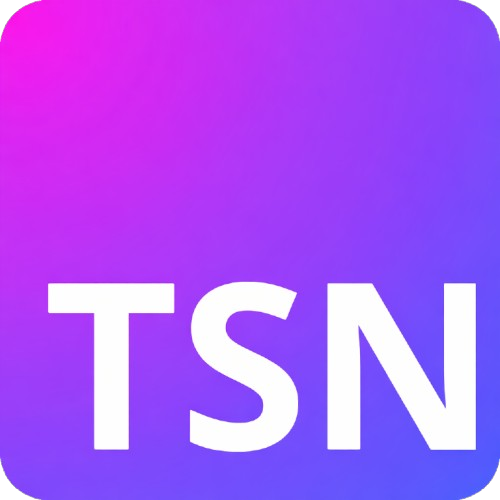

<div align="center">
  
  
  # TSN - TSN Standard Notation
  
  **A recursive acronym: TSN Standard Notation**  
  *High-performance systems programming with TypeScript elegance.*
  
  [](https://opensource.org/licenses/Apache-2.0)
  [](https://github.com/TSNLang/TSN)
  [](https://github.com/TSNLang/TSN)
  [](self-hosting/README.md)
  
  *Made with ❤️ in Ho Chi Minh City, Vietnam by [Sao Tin Developers](https://github.com/SaoTin)*
</div>

---

## 🎯 What is TSN?

**TSN** is a systems programming language that maintains the elegant syntax of TypeScript while compiling directly to native code via **LLVM IR**.

Unlike standard TypeScript which runs on a VM (V8/JSC) with a Garbage Collector, TSN is designed for performance-critical applications, providing deterministic memory management and zero-overhead abstractions.

## 🚀 Version History & Changelog

All version details, releases, and development milestones have been moved to [CHANGELOG.md](CHANGELOG.md). Please refer to it for the complete history of compiler updates, self-hosting progress, standard library advancements, and version plans.

## 💪 Core Language Features

### 🛡️ Memory Management (Ownership Model)

TSN employs a state-of-the-art memory management system:

- **`struct` (Value Type)**: Stack-allocated, using **Copy Semantics**.
- **`class` (Reference Type)**: Heap-allocated, using **Move Semantics** (Destructive move). Memory is automatically `free`'d as soon as the owner goes out of scope (RAII).
- **Automated Borrowing**: Automatically handles reference borrowing for function calls, keeping the syntax clean like TypeScript while remaining as safe as Rust.

### ✨ Type System & OOP

- **Native Types**: `i8`, `i16`, `i32`, `i64`, `ptr<T>`, `bool`, `string`.
- **Inheritance**: Full support for `extends` in both classes and structs (Field flattening).
- **Polymorphism**: Virtual methods and **VTables** for dynamic dispatch.
- **Interfaces**: Define contracts with `interface` and implement them with `implements`.
- **FFI (Foreign Function Interface)**: Seamlessly call C/C++ libraries and system APIs using `@ffi.lib()`.

### ⚡ Performance

- Compiles directly to **LLVM IR**, benefiting from world-class optimizations.
- No VM overhead or Garbage Collector pauses.
- Execution speed comparable to C++/Rust.

---

## ⚠️ Known Limitations

TSN prioritizes performance and memory safety. Some TypeScript features are intentionally omitted or deferred:
- **Intersection Types**: Currently not supported due to memory layout complexity.
- **`any` Type**: Not supported to maintain strict type safety and performance.
- **`never` Type**: Deferred until advanced control-flow analysis is implemented.

For more details, see [Language Limitations](docs/limitations.md).

---

## 📜 License

This project is licensed under the Apache License 2.0 - see the [LICENSE](LICENSE) file for details.

```
Copyright 2024-2026 Sao Tin Developer

Licensed under the Apache License, Version 2.0 (the "License");
you may not use this file except in compliance with the License.
You may obtain a copy of the License at

    http://www.apache.org/licenses/LICENSE-2.0

Unless required by applicable law or agreed to in writing, software
distributed under the License is distributed on an "AS IS" BASIS,
WITHOUT WARRANTIES OR CONDITIONS OF ANY KIND, either express or implied.
See the License for the specific language governing permissions and
limitations under the License.
```

---

## 🙏 Acknowledgments

- **LLVM Project** - For the amazing compiler infrastructure
- **TypeScript Team** - For the inspiration and syntax design
- **Rust** - For systems programming language design patterns
- **Mojo** - Because of the idea of ​​memory security

## 🌟 Inspired By

TSN stands on the shoulders of giants. We acknowledge these pioneering projects that explored TypeScript-to-native compilation:

- **[TypeScriptCompiler](https://github.com/ASDAlexander77/TypeScriptCompiler)** by ASDAlexander77
- **[tsll](https://github.com/sbip-sg/tsll)** by SBIP-SG
- **[StaticScript](https://github.com/ovr/StaticScript)** by ovr
- **[llts](https://github.com/bherbruck/llts)** by bherbruck
- **[ts-llvm](https://github.com/emillaine/ts-llvm)** by emillaine

---

## 📞 Contact & Community

- **Primary Repository**: [TSNLang/TSN on GitHub](https://github.com/TSNLang/TSN)
- **Official Mirrors**: [TSN/TSN on Codeberg](https://codeberg.org/TSN/TSN) and [TSNLang/TSN on GitLab](https://gitlab.com/TSNLang/TSN) are official mirrors/archives of the project
- **Organization**: [Sao Tin Developer](https://github.com/SaoTin)
- **Issues**: [Report bugs or request features](https://github.com/TSNLang/TSN/issues) on the primary GitHub repository only
- **Discussions**: [Join the conversation](https://github.com/TSNLang/TSN/discussions) on the primary GitHub repository only
- **Mirror Policy**: Please do not send issues, pull requests, or other contribution traffic to mirror repositories

---

<div align="center">
  
  **Made with ❤️ in Ho Chi Minh City, Vietnam**
  
  *Bringing TypeScript-inspired syntax to Systems Programming*
  
  ⭐ Star us on GitHub if you find TSN interesting!
  
  **Note**: TSN is inspired by TypeScript syntax but is an independent project not affiliated with or endorsed by Microsoft or the TypeScript team.
  
</div>

